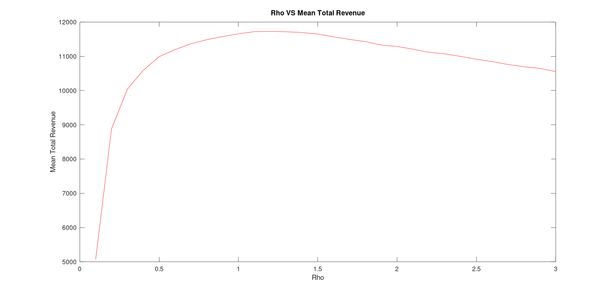

# Electric_Vehicle_Charging_Simulation
The goal of this project is to build a simulation model to determine the largest expected revenue from an electric vehicle charging station in a one month time period given the storage capacity, charging grid change costs, demand and supply.

## The highest revenue was found to be 11,727 USD with a Rho value at 1.2. Rho is a sensible parameter that was used to simplify the commitment mechanism. A plot for different Rho values versus the mean total revenue has been plotted and the curve tends to fall after the highest revenue point. 

